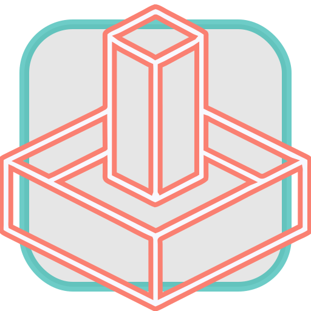

# Tower Defense Game - Three.js Experimentations  

__Description__: Building a Tower Defense Game while experimenting the Three.js library.  

__Note__: Each chapter is based on the code of the previous chapter.  

  

---
## 01. Hello World - Cube

Draw and rotate a simple cube.  
[Live here.](https://dorianbayart.github.io/three.js/hello-world-cube/)  

---
## 02. Wave of Spheres

Animate a grid of spheres.  
[Live here.](https://dorianbayart.github.io/three.js/wave-of-spheres/)  

---
## 03. Lights

Lihts and reflection on objects.  
[Live here.](https://dorianbayart.github.io/three.js/lights/)  

---
## 04. Camera

Camera moves around the scene.  
[Live here.](https://dorianbayart.github.io/three.js/camera/)  

---
## 05. Maze

A maze generator.  
[Live here.](https://dorianbayart.github.io/three.js/maze/)  

---
## 06. Mouse Events

Detects mouse events to do action on the maze.  
[Live here.](https://dorianbayart.github.io/three.js/mouse-events/)  

---
## 07. Mobs

Mobs are coming !  
[Live here.](https://dorianbayart.github.io/three.js/mobs/)  

---
## 08. Towers

Build towers on the map.  
Display text with Pixi.js library (directly on the canvas)  
Add a bit of 'gameplay': money + score + remaining lives  
[Live here.](https://dorianbayart.github.io/three.js/towers/)  

---
## 09. Missiles

Missiles are flying through the map !  
[Live here.](https://dorianbayart.github.io/three.js/missiles/)  

---
## 10. Particules (Ammo.js)

Add particules effect on missile explosion.  
Add physics (Ammo.js)  
Add shadows  
[Live here.](https://dorianbayart.github.io/three.js/particules/)  

---
## 11. Rotate the map with mouse (OrbitControls)

Huge update to use modules  
Zoom in/out  
Rotate the map  
Add a builder mob + list of tasks to do (build towers)  
It takes some time to build a tower  
[Live here.](https://dorianbayart.github.io/three.js/controls/)  

---
## 12. Energy

Add the _energy_ concept:
- the builder produces energy
- building a tower consumes energy
- towers in 'attack mode' are consuming energy  
[Live here.](https://dorianbayart.github.io/three.js/energy/)  

---
## 13. Upgrade towers

Choose the tower you want to build
Add different tower types (+ missiles):
- normal
- rocket
- laser
- speed bump
- poison ?

A tower can be upgraded (improve GUI)  
Introduce tower experience  

Add _energy_ buildings (producer, capacitor/storage)  
[Live here.](https://dorianbayart.github.io/three.js/upgrade/)  

---
## 14. Add predefined levels (TODO)

Create predefined levels (Beginner / Intermediate):
- map
- initial money
- mob generation  

Select the level you want to play (display a preview)  

---
## Ideas (TODO)

- PWA
- Improve paths with smooth angles
- Rotate the towers
- Rotate the mobs
- Try to reduce polygons (group adjacent walls into one larger rectangular wall)
- Overview of the map in a corner
- Collision detection missiles / walls (higher difficulty mode)  
